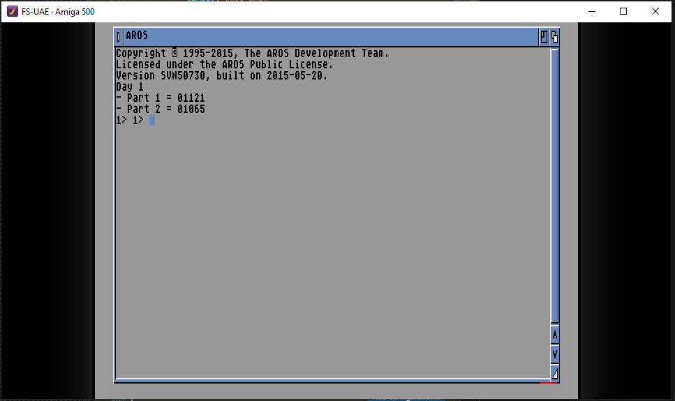

# advent_of_code_2021
My contribution for Advent of Code 2021 in C# and Amiga assembler (MC68000)

## C# version
- Written using VS 2020 and .NET 6

## Amiga assembler version
*NOTE!* At the moment I do not know if I'll be able to complete all day exercises in assembler but will give it an honest effort :)

- Written in MC68000 assembler using VS Code and Amiga Assembly extension by Paul Raingeard

Example below of day 1 exercise completed :D

